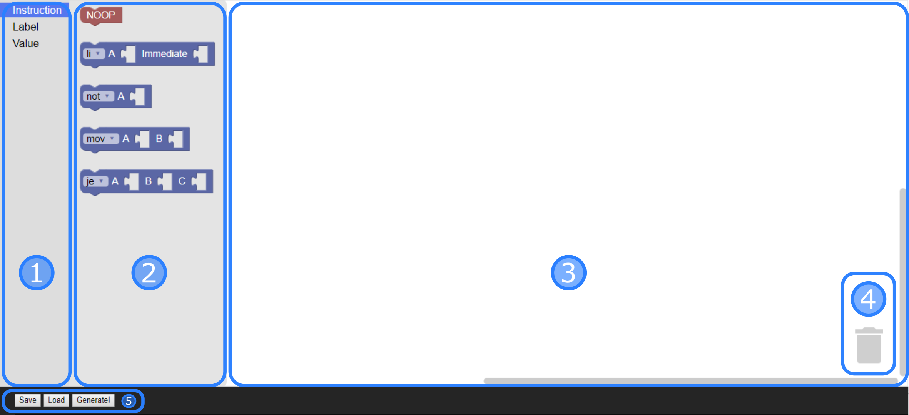
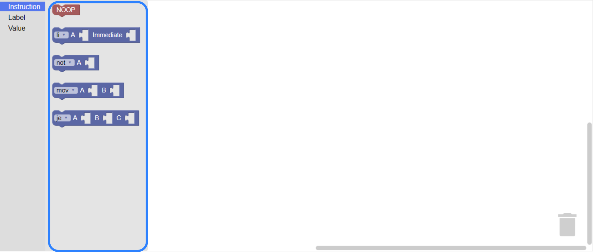
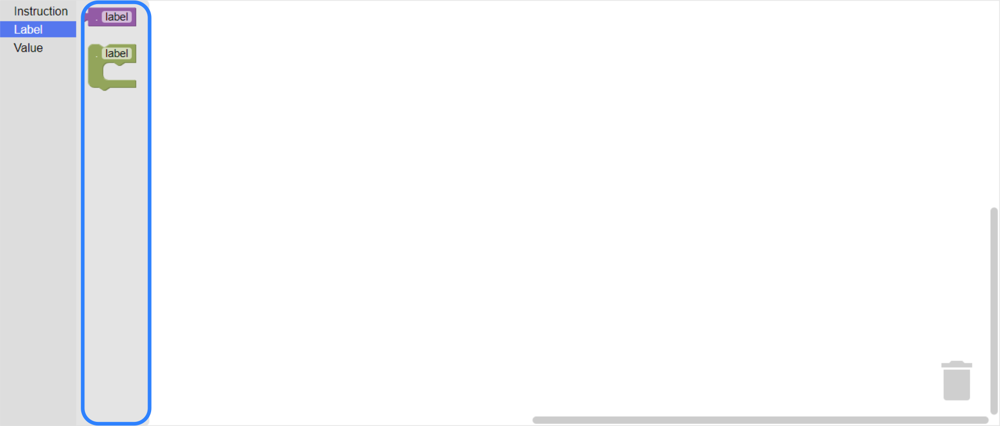
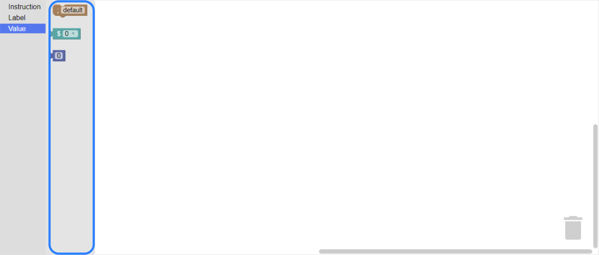

## The block editor

​	The [Blockly](https://developers.google.com/blockly/) code editor for quanta allows you to write valid assembly code using block diagrams. Every feature available in the quanta assembly language has been ported to the block editor, making it a fully featured development environment.

​	The main editor window is split into 2 main sections, one of which can be expanded to reveal the available blocks, and a trash can icon.

​	The area 1 is your toolbox, where you can select the type of block you want to place into your diagram. Once a type has been picked, section 2 will appear, showing all the available blocks for that type. The desired block can then be dragged into the editor window.

​	The area 3 is the main window, and where you construct your block diagram. You can drag blocs around, connect  and disconnect blocks and such. You can right click blocks to bring a menu with extra options such as disabling, duplicating, or going to the documentation for help (which is not yet done).

​	Finally the trash can works as. Well. A trash can. Dropping blocks into it removes them from the diagram, but this action can be easily undone.

### WRITING PROGRAMS

#### Instructions

​	The instruction category of the toolbox holds all the actual instructions that can be used on your program. Each instruction type has it's custom block, respectively from top to bottom the NOOP, immediate, single register, double register and triple register types.

​	After picking the block for the instruction type you want, you can use the dropdown on the left of the block to select any of the particular instructions available and plug in values into the respective slots. At the moment the register type slots can also hold labels, so keep that in mind, as it could generate incorrect code from a valid Blockly workspace. (This design choice was made to enable jumps to labels but fixing it is on the [quanta development board on Trello](https://trello.com/b/ftTGVmk0/quanta) as "Add label validation system".)

####Labels

​	The label category of the toolbox holds all the label related blocks that can be used on your program, respectively from top to bottom, the label value and the label holder blocks.

​	The label value can be plugged into instruction blocks for jumping to the label holder of the same name. While the label holder block does not translate to any instruction, it can hold a group other blocks that will be translated to a labelled group when the code is generated.

​	You can get a label value that refers to a non-existent labelled group, so keep that in mind, as it could generate incorrect code from a valid Blockly workspace. (Developing a label manager to avoid this is pretty hard but fixing it is on the [quanta development board on Trello](https://trello.com/b/ftTGVmk0/quanta) as "Add label validation system".)

####Values

​	The value category of the toolbox holds all the blocks that can represent a value, and thus be plugged into instruction blocks, and the comment block. Respectively from top to bottom, the comment block, the register block and the numeric block.

​	The comment block is added sequentially to the code, and does pass through the code generation. The register block provides a dropdown with the ids of all the registers the programmer can access, so the numeric value block should only be used as an immediate.